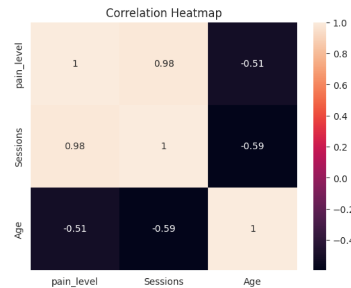

# Physiotherapy-Recovery-Visualization-System
Python based data analysis project for physiotherapy patient recovery tracking.
### Features:
-Patient pain analysis with bar chart.
-Therapy sessions tracking with line plot.
-Rcovery status count visualization.
Correlation Heatmap: Pain level Vs Sesssions Vs Age.
### Tool Used:
Python , Pandas , Seaborn , Matplotlib
### Sample Output:

### How to Run:
1.Install:import pandas ,seaborn ,matplotlib
2.Run:Python physio_analysis .py
